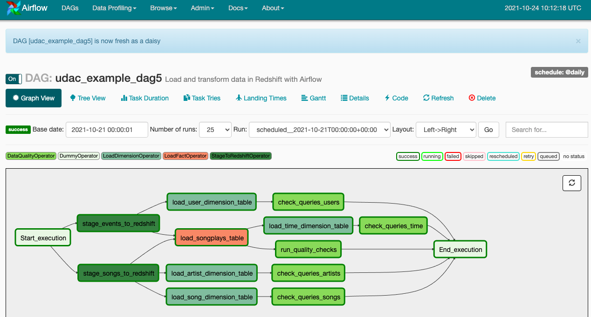

# Data Pipeline with Airflow
This runs tasks which ingest data from data files into the fact and dimension tables on Redshift

# Datasets
- Log data: s3://udacity-dend/log_data
- Song data: s3://udacity-dend/song_data

# Structure
## create_tables.sql
SQL create table statements
## uda_dag.py
dag script
## Operators
- stage_redshift.py: Defines StageToRedshiftOperator to copy JSON data from S3 to - staging tables in the Redshift via copy command.
- load_dimension.py: Defines LoadDimensionOperator to load a dimension table from staging table(s).
- load_fact.py: Defines LoadFactOperator to load fact table from staging table(s).
- data_quality.py: Defines DataQualityOperator to run data quality checks on all tables passed as parameter.
- sql_queries.py: Contains SQL queries for the ETL pipeline (provided in template).

# How to run
## set connection
- aws_conn_id: credential for Amaozon Web Services
-- Conn Id: aws_conn_id
-- Conn Type: Amazon Web Services
-- Login: xxx
-- Password: xxx
-- Extra: {"region_name": "us-west-2"}
- redshift: credentail for Redshift
-- Conn Id: redshift_conn_id
-- Conn Type: Postgres
-- Host: redshift-cluster-1.czdgn4tjdbsk.us-west-2.redshift.amazonaws.com
-- Schema: dev
-- Login: xxx
-- Password: xxx
-- Port: 5439

## start airflow
- /opt/airflow/start.sh
- check graph view
